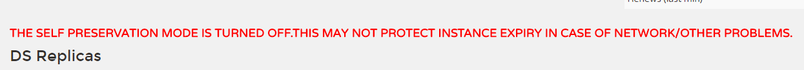

### Eureka包含两个组件Eureka Server和Eureka Client  
* Eureka Server提供服务发现的能力，各个微服务启动后将自己信息如IP、port、name等发送给Eureka Server,并被保存起来
* Eureka Client 是一个java客户端，用于简化与Eureka Server的交互
* 服务启动后，默认`30秒`向注册中心发送心跳
* Eureka Server 默认`90秒`没有收到服务的心跳将注销该实例
* Eureka Server同时也是Eureka Client多个Eureka Server互相通过复制实现服务的注册数据同步
* Eureka Client 会缓存注册信息，无需每次请求Eureka Server，降低其压力，其次即使Eureka Server全部宕机，服务消费者可以在缓存中获取信息完成服务调用

## 使用
### 创建Eureka Server 
启动类上添加`@EnableEurekaServer`并且配置文件中添加
```
spring.application.name=cloud-eureka-server
server.port=8761
eureka.instance.hostname=localhost
表示是否将自己注册到Eureka Server,默认为true  
eureka.client.registerWithEureka = false  
表示是否从Eureka Server获取注册信息，默认为true。单点的Eureka Server不需要同步其他Eureka Server的数据
eureka.client.fetchRegistry = false  
设置与Eureka Server交互的地址，查询与注册服务都要依赖这个地址，默认http://localhost:8761/eureka多个地址用逗号分隔
eureka.client.serviceUrl.defaultZone=http://${eureka.instance.hostname}:${server.port}/eureka/
```

### Eureka Client 各个微服务
启动类上添加`@EnableDiscoveryClient`申明一个Eureka Client,也可以使用`@EnableEurekaClient`替代，  
但不如`@EnableDiscoveryClient`通用，另外`@SpringCloudApplication`整合了`@SpringBootApplication`和`@EnableDiscoveryClient`
```
指定注册到Eureka Server上的应用名称
spring.application.name=cloud-account
表示将自己的ip注册到Eureka Server，不配置表示注册微服务所在操作系统的hostname到Eureka Server
eureka.instance.prefer-ip-address=true
```

### Eureka Server集群
因为测试使用的一台机器，要修改配置系统hosts
* windows系统hosts文件在`C:\Windows\System32\drivers\etc\hosts`
* linux及mac os在`/etc/hosts`
```
127.0.0.1 peer1 peer2
```
新建一个Eureka Server
```
# 注册到Eureka Server上的名称
spring.application.name=cloud-eureka-server
#指定端口
server.port=8762
spring.profiles.active=peer2
eureka.instance.hostname=peer2
# 将自己注册到peer1这个Eureka上去
eureka.client.serviceUrl.defaultZone = http://peer1:8761/eureka/
```  
也可以在原先的基础上增加配置文件，启动jar的时候指定，类似
```
java -jar cloud-eureka-server-0.0.1-SNAPSHOT.jar --spring.profiles.active=peer1
```

### 为Eureka Server添加认证
添加依赖
```
<dependency>
	<groupId>org.springframework.boot</groupId>
	<artifactId>spring-boot-starter-security</artifactId>
</dependency>
```
并且添加配置
```
#开启基于HTTP basic的认证
security.basic.enabled=true
#登录账号
security.user.name=user
#登录密码
security.user.password=123
```
不配置账号默认是user,密码是随机值，在启动时打印出来  
此时Eureka Client需使用或者Eureka Server相互注册时要用下列方式配置
```
eureka.client.serviceUrl.defaultZone=http://<username>:<password>@${eureka.instance.hostname}:${server.port}/eureka/
```

### Eureka元数据
可以使用`eureka.instance.metadata-map`属性在各服务自定义Eureka元数据

### Eureka端点
GET /eureka/apps  查看所有实例
GET /eureka/apps/appID   查看特定实例，appID是应用的名称
其他端点不赘述

### Eureka自我保护机制
Eureka Server 90秒收不到Eureka Client心跳会注销该实例，但断网时，短时间内会丢失大量客户端，此时会进入自我保护模式，不再删除任何客户端信息，网络恢复后自动退出自我保护模式。 
可以使用`eureka.server.enable-self-preservation=false`来禁用自我保护模式，此时注册中心页面会报错误提示


### 多网卡环境下Eureka Client指定注册到Eureka Server上的IP
* 忽略指定名称网卡
```
忽略docker0和以lee开头的网卡
spring.cloud.inetutils.ignored-interfaces=docker0,lee.*
eureka.instance.prefer-ip-address=true
```
* 使用正则指定网络地址
```
spring.cloud.inetutils.preferred-networks=192.168,10.0
eureka.instance.prefer-ip-address=true
```
* 只使用站点本地地址
```
spring.cloud.inetutils.use-only-site-local-interfaces=true
eureka.instance.prefer-ip-address=true
```
* 手动指定IP地址
```
eureka.instance.prefer-ip-address=true
eureka.instance.ip-address=127.0.0.1
```

### Eureka的健康检查
有时Eureka Client与Eureka Server的心跳正常，Eureka Server显示该客户端为UP状态，但也许Client无法连接数据源等情况，是的该Client的服务不可用，可以通过actuator的/health端点将健康信息传递过来。  
需要在Eureka Client中配置
````
#开启健康检查（需要spring-boot-starter-actuator依赖）
eureka.client.healthcheck.enabled = true
````